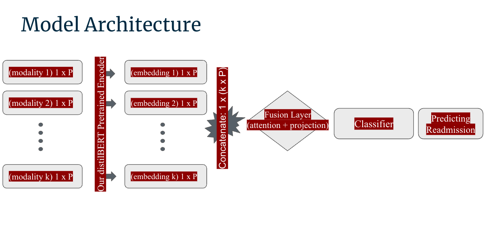
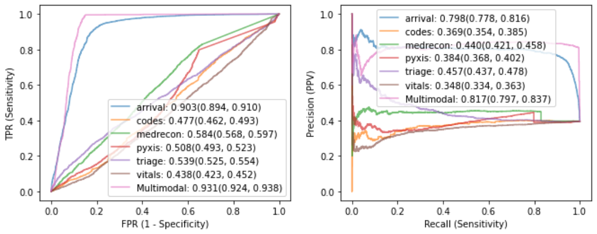

# Multimodal Clinical pseudo-notes for EHR prediction

Electronic Health Records (EHR) are comprehensive databases containing multimodal information about a patient's health history. In recent years, Transformer-based models have shown promise in various downstream tasks, including mortality prediction and diagnosis. However, these approaches have either considered one component of EHR, or considered its multiple components as a single data modality. In this work, we treat EHR as multimodal, separately representing concepts like diagnoses, medications, procedures, and lab values. Our novel "pseudo-notes" method transforms these modalities into structured language texts, allowing us to leverage general Large Language Models (LLMs) for individual EHR representation from the MIMIC-IV database. Additionally, we introduce an additional self-attention layer for late fusion of these embeddings to gain a joint representation of a patient, followed by a projection into a reduced space for inference. We fine-tune our model with this newly added layer for predicting Emergency Department (ED) Disposition and find our multimodal model outperforms against a single modality method, and other machine learning methods, demonstrating its effectiveness.

## Method

In this work, we introduce two novelties within our proposed framework: The first is to convert EHR to textual prompt which generate our pseudo-notes. The second is to learn a joint representation of these separate modality embeddings in order to obtain state of the art accuracy of predicting Emergency Department (ED) Disposition. We achieve this by implementing a dual network architecture where we encode our concepts in a BERT model, in our case the pretrained *distil-bert*, to generate separate embeddings for each EHR concpet. Upon completing this, we then concatenate and feed it to an additional network which performs a late fusion of these embeddings by highlighting the most important parts of each modality into a singular joint representation. 

#### Network 1: Generate Embeddings

Network One's objective is to generate embeddings for each EHR concept. Within our training loop, we start by inputting tokenized data into the frozen *Distil-BERT* encoders, producing embeddings for each concept. While previous works update BERT model weights, we concentrate on updating parameters in the subsequent network, which handles the specific task. Once embeddings for all concepts are generated, we concatenate them into a single input for the next network to process.

#### Network 2: Late Fusion Attention Layer for Joint Representation

After generating the embeddings and concatenating the output of the first network, we proceed to our second network, whose objective is to create a late fusion of all our modalities to generate a joint representation. This network contains a singular self-attention layer followed by a projection layer into reduced dimensionality before finally passing through a classifier layer to produce our logits. Currently, within our patient vector, we have modalities that were all embedded separately and, for this reason, are not considered in unison. So, despite its compact size, this new network plays a crucial role. The addition of this network allows it to take the concatenated input and 're-focus' its attention, emphasizing the most important aspects of our combined input to create a new unified vector representation. Unlike our first network, we do update the gradients of this component because we are training an attention layer from scratch and need to learn the underlying patterns before inference. Therefore, after each batch, the gradients get updated accordingly.

To assess the performance of our method, we compared it to a single-modality model that merges all the modalities into a single embedding, as well as a deep neural network and a Random Forest model. We conducted a preliminary benchmarking study to predict ED Disposition and tested whether the pseudo-notes and late fusion mechanism outperforms other more standard approaches. We conduct all our analysis in the Python programming language utilizing models publicly available on the *HuggingFace* Platform. In terms of resources required for training and inference we utlizied a The g4dn.4xlarge instance from *AWS Cloud Services*, which is in the gpu instance family with 16 vCPUs, 64.0 GiB of memory and up to 25 Gibps of bandwidth.

## Results

| Method | F1 Results |
| --- | --- |
| arrival-only Transformer | 0.566 (0.554, 0.579) |
| codes-only Transformer | 0.418 (0.400, 0.434) |
| medrecon-only Transformer | 0.567 (0.553, 0.580) |
| pyxis-only Transformer | 0.564 (0.551, 0.577) |
| triage-only Transformer | 0.566 (0.544, 0.579) |
| vitals-only Transformer | 0.566 (0.544, 0.579) |
| Multimodal Transformer | 0.894 (0.885, 0.903) |
| MLP | n/a |
| Random Forest Classifier | n/a |

It is very clear that the multimodality method outperforms single modality methods. Therefore there is a lot of merit in using as much data available about a singular patient in trying to assess something as simple as a Emergency Department Disposition.

## TODO

- Test the generalibility by using different LLMs
- test on hospital to hospital systems (MIMIC-UCLA)
- rewrite the paper
- take into account all the reviews
- Demonstrate on more general tasks extending it capabilities to other domains in an appendix

## Authors
- Simon Lee (simonlee711@g.ucla.edu)
- Arabdah Biswas (arabdhab@g.ucla.edu)
- Akos Rudas (akosrudas@g.ucla.edu)
- Jeffrey Chiang (njchiang@g.ucla.edu)

